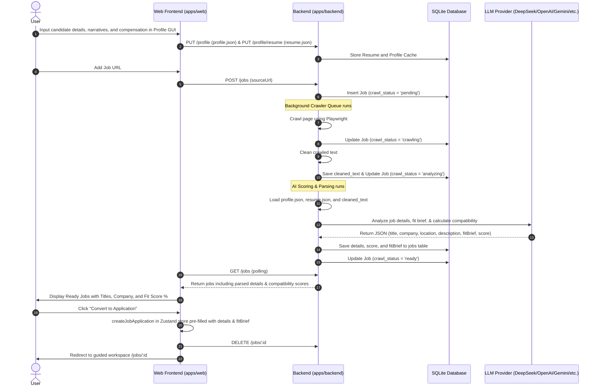

# Profile-Based Backend Job Scoring & Parsing Design

## Purpose

Connect the crawled raw job postings to the active job application pipeline. Instead of requiring manual input or client-side parsing, the local backend will own the AI interpretation and scoring. Once a job posting is crawled, the backend will use a candidate profile (`profile.json`) and the user's default resume to automatically extract job details, analyze match fit, and calculate a compatibility score. 

The candidate profile will be fully configurable via a rich, interactive graphical user interface (GUI) on the web frontend. The backend will support OpenAI, Gemini, Anthropic, and **DeepSeek API** as providers, using prompts that mirror the Career-Ops job evaluation rubric.

## Architecture & Data Flow



---

## 1. Candidate Profile Configuration GUI

The candidate profile is stored as a structured JSON file locally at `apps/backend/config/profile.json` (or cached in SQLite) and is updated via a tabbed frontend configuration dashboard.

### Profile Structure:
- **`candidate`**: Full Name, Email, Phone, Location, Portfolio, LinkedIn, GitHub.
- **`target_roles`**: Array of primary roles and target archetypes (role name, level, suitability category).
- **`narrative`**: Headline exit story (1 line), professional summary, and list of superpowers.
- **`proof_points`**: Array of accomplishments/projects (name, URL, hero metric).
- **`compensation`**: Target range, currency, minimum, preferred, and location flexibility details.
- **`location`**: Timezone, country, onsite availability, and remote preferences.

---

## 2. Backend API & Data Storage

### SQLite Schema Extensions
We extend the `jobs` table in the SQLite database to store the parsed details, score, and generated fit brief:

```sql
ALTER TABLE jobs ADD COLUMN parsed_title TEXT;
ALTER TABLE jobs ADD COLUMN parsed_company TEXT;
ALTER TABLE jobs ADD COLUMN parsed_location TEXT;
ALTER TABLE jobs ADD COLUMN parsed_description TEXT;
ALTER TABLE jobs ADD COLUMN fit_score INTEGER;
ALTER TABLE jobs ADD COLUMN fit_brief_json TEXT;
```

### New API Endpoints
- **`GET /profile`**: Returns the candidate profile JSON.
- **`PUT /profile`**: Saves the updated candidate profile.
- **`GET /profile/resume`**: Returns the currently synced default resume.
- **`PUT /profile/resume`**: Syncs the default resume from the web frontend to the backend.

---

## 3. Backend AI Interpretation & Scoring (Career-Ops Mirror)

Once crawling finishes, the queue schedules the AI parsing task and updates the status to `analyzing`. 

### AI Provider Selection
The backend reads the default provider and credentials from its environment variables (`apps/backend/.env`) or from the synced settings:
- **DeepSeek API** (`DEEPSEEK_API_KEY`, using model `deepseek-chat`) is fully supported as a first-class provider.
- OpenAI, Google (Gemini), and Anthropic are also supported.

### Career-Ops System Prompt Mirroring
The system prompt in the backend analyzer mirrors the multi-dimensional Career-Ops scoring and matching guidelines:

1. **North-Star Archetype Alignment**: Evaluate how well the job description matches the candidate's target archetypes (e.g. Senior Full Stack Engineer).
2. **Superpowers Match**: Verify if the role leverages the candidate's stated narrative exit story and superpowers.
3. **Compensation & Location Suitability**: Compare the job's compensation structure (if found) against candidate targets, and check remote policy compatibility.
4. **Red Flags Identification**: Explicitly check for warning signs (e.g. visa sponsorship required but not offered, mismatched technologies, legacy system maintenance without feature development).
5. **Auditable Fit Score**: Compute an overall match score from 0 to 100 based on the rubric, outputting clear citations for each rating.

---

## 4. Frontend UX & Dashboard

### Restoring the Job Pipeline
Modify `apps/web/src/routes/jobs.tsx` to display:
1. **Job Applications Grid**: Restore the active list of saved, tailoring, and applied jobs, including status filters and the pipeline integrity panel.
2. **Backend Queue Panel**: Show the local crawler queue at the top of the page.

### Enhanced Queue Cards
Ready cards in the crawler queue will display:
- **Title and Company**: Parsed by AI instead of the raw URL hostname.
- **Compatibility Score Badge**: Visually prominent badge (e.g., `92% Match` in green, `65% Match` in yellow, `30% Match` in red).
- **Convert to Application Button**: Instantly copies the parsed details and fit brief into the web's job application store, deletes the queue item, and redirects the user to the workspace.

### Profile Settings Page
Add a route `/profile` in the web frontend where users can edit their profile details in a graphical form, view the synced resume status, and configure credentials (including DeepSeek).
