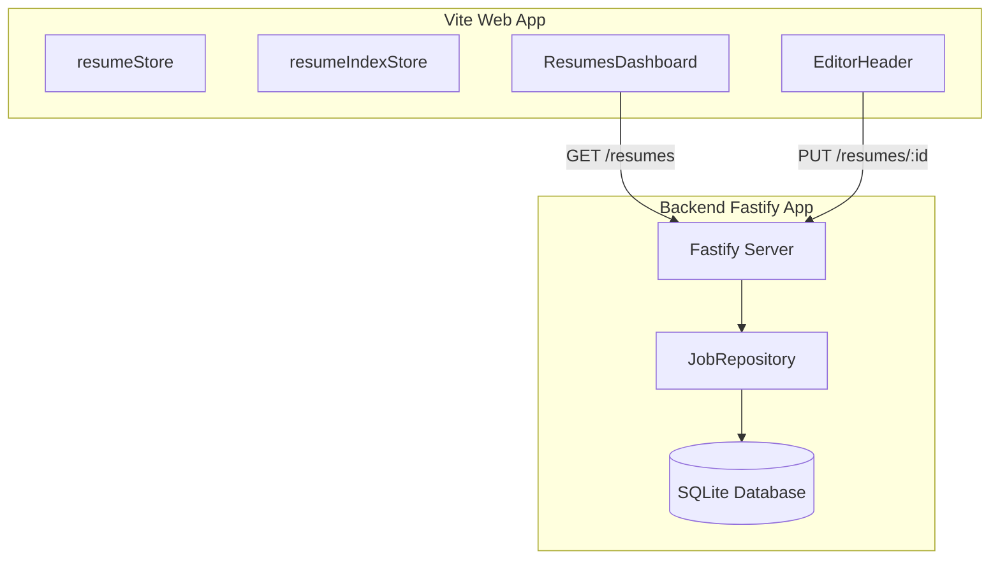

# SQLite-Backed Resumes Design Spec

**Date:** 2026-06-11  
**Status:** Draft  

This specification details the design for migrating resume storage from browser `localStorage` in the frontend (`apps/web`) to a local SQLite database in the backend (`apps/backend`). 

This change moves the application from a Cloudflare Workers standalone deployment target to a locally-run desktop/backend application.

Existing browser `localStorage` resume data is intentionally not migrated into SQLite. After this change, SQLite is the source of truth for resumes, and users can recreate or import resumes through the new backend-backed flows.

---

## 1. System Architecture



---

## 2. Database Schema (SQLite)

We will introduce a new `resumes` table in the backend SQLite database. To ensure only one default resume can exist, we will use a partial unique index.

```sql
CREATE TABLE IF NOT EXISTS resumes (
    id TEXT PRIMARY KEY,
    name TEXT NOT NULL,
    template_id TEXT NOT NULL,
    last_modified INTEGER NOT NULL,
    is_default INTEGER DEFAULT 0 CHECK(is_default IN (0, 1)),
    content_json TEXT NOT NULL
);

-- Ensures at most one default resume (is_default = 1) can exist
CREATE UNIQUE INDEX IF NOT EXISTS resumes_default_idx ON resumes(is_default) WHERE is_default = 1;
```

---

## 3. Backend API endpoints

We will define new routes and schemas under `apps/backend/src/server.ts` and `apps/backend/src/schema.ts`.

### 3.1 Zod Schemas (`apps/backend/src/schema.ts`)
We will export new schemas:
- `resumeSummarySchema`: `{ id, name, templateId, lastModified, isDefault }`
- `resumeDetailsSchema`: `{ id, name, templateId, lastModified, isDefault, content }`
- `createResumeRequestSchema`: `{ id, name, templateId, content }`
- `updateResumeRequestSchema`: `{ name?, templateId?, content? }`

### 3.2 Routes
- **`GET /resumes`**: Returns list of all resume summaries.
- **`GET /resumes/:id`**: Returns full details of a resume (including its content).
- **`POST /resumes`**: Creates a new resume entry.
- **`PUT /resumes/:id`**: Updates resume details.
- **`DELETE /resumes/:id`**: Deletes a resume.
- **`PUT /resumes/:id/default`**: Sets a resume as default (clears others).
- **`DELETE /resumes/default`**: Clears the current default resume.

### 3.3 /profile/resume Backward Compatibility
We will update `GET /profile/resume` to read the active default resume from the SQLite database:
```typescript
const defaultResume = jobRepository.getDefaultResume();
```
If no default resume exists, this route returns `404` with the existing backend error response shape.

We will also update `PUT /profile/resume` to write through SQLite instead of `resume.json`. This endpoint should upsert a backend resume record for the synced resume and mark it as default, so existing `syncResume()` callers cannot successfully write to a stale file-backed path while `GET /profile/resume` reads from SQLite.

The backend should stop using `resume.json` as a second resume store once these endpoints are SQLite-backed.

---

## 4. Frontend Changes (`apps/web`)

### 4.1 Backend Client API (`apps/web/src/lib/local-backend-client.ts`)
Add helper functions to perform HTTP queries to the backend server:
- `listResumes()`
- `getResume(id)`
- `createResume(id, name, templateId, content)`
- `updateResume(id, data)`
- `deleteResume(id)`
- `setDefaultResume(id)`

### 4.2 Zustand Stores

#### `resume-index-store.ts`
- Remove all `localStorage` reads, writes, and legacy migrations.
- State: `{ resumes: [], defaultResumeId: null }`
- New actions:
  - `loadIndex()`: Fetches `/resumes` to load list of resumes.
  - `createResumeIndexEntry(id, name, templateId)`: Calls client to create a new resume on the backend.
  - `deleteResumeIndexEntry(id)`: Calls client to delete from backend.
  - `setDefaultResumeId(id)`: Calls client to set default.
    - When `id` is a resume id, call `PUT /resumes/:id/default`.
    - When `id` is `null`, call `DELETE /resumes/default`.

#### `resume-store.ts`
- Convert `loadResume(id)` to be asynchronous.
- Trigger `updateResumeName(name)` which updates the store state.
- **Debounced Save to Backend:**
  - Remove direct `localStorage` persistence.
  - Set up a store subscriber that debounces (500ms) updates and fires a `PUT /resumes/:id` request to the backend app, syncing the active resume name, templateId, and full content.

---

## 5. UI Components

- **`ResumeCard.tsx`**: Add `shrink-0` to the resume name element class list to prevent height collapse in the flex container.
- **`EditorHeader.tsx`**: Remove `readOnly` from the name `<Input />` and connect `onChange` to trigger `updateResumeName(e.target.value)`.
- **`resumes.tsx`**: Load the index via `loadIndex()` inside a mount `useEffect`.
- **`editor/$id.tsx`**: Await the asynchronous `loadResume(id)` result before clearing the loading state. If the backend returns 404, initialize from the index entry or show an error state; do not rely on the old synchronous boolean contract.

---

## 6. Verification Plan

### Automated tests
- Unit tests for the backend routes in `apps/backend/src/server.test.ts`.
- Unit tests for repository functions in `apps/backend/src/jobs/repository.test.ts`.
- Unit tests for the frontend stores in `apps/web/src/lib/resume-store.test.ts` and `apps/web/src/lib/resume-index-store.test.ts` updating them to use mocked API responses.

### Manual verification
- Launch Vite web server and backend server concurrently (`pnpm dev`).
- Verify that default resumes display correctly in the dashboard with their names.
- Verify editing the name in the editor header updates instantly and persists across navigation.
