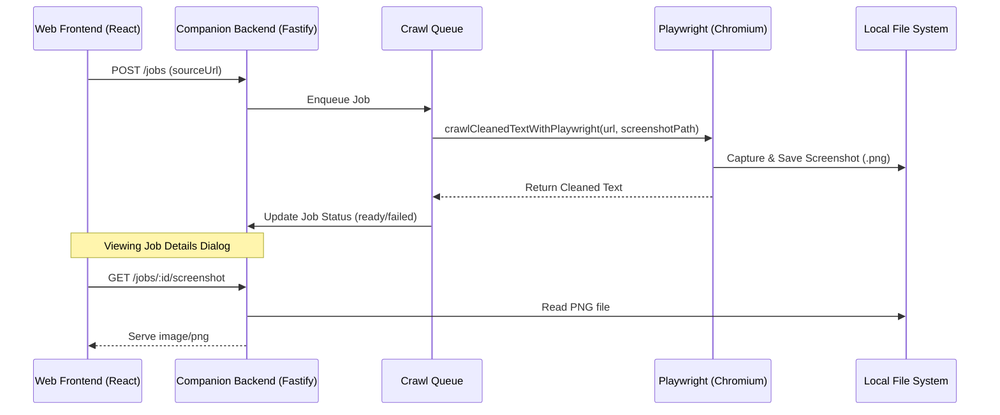

# Design Spec: Job Crawl Screenshots

We want to capture full-page PNG screenshots of crawled job pages (on both success and failure) to debug rendering issues, such as CAPTCHA challenges or layout timeouts. The screenshot will be saved on disk, served via the companion Fastify API, and displayed in the frontend's companion job details dialog.

## Proposed Architecture



## Detailed Changes

### 1. Configuration (`apps/companion`)

#### [config.ts](file:///Users/ben/ghq/github.com/Benjaminlooi/resume-builder/.worktrees/job-application-ai-helper/apps/companion/src/config.ts)
- Add `screenshotsPath` (string) to `ResolvedConfig` interface.
- Resolve it in `resolveConfig` relative to the SQLite database path:
  ```typescript
  const screenshotsPath = resolve(dirname(databasePath), "screenshots");
  ```

#### [server.ts](file:///Users/ben/ghq/github.com/Benjaminlooi/resume-builder/.worktrees/job-application-ai-helper/apps/companion/src/server.ts)
- Ensure the screenshots directory is initialized on startup:
  ```typescript
  mkdirSync(config.screenshotsPath, { recursive: true });
  ```
- Pass `screenshotsPath` into the route contexts and update the `crawl` queue method parameter to accept `jobId` so it can resolve the file name.

### 2. Playwright Scraper (`apps/companion`)

#### [playwright.ts](file:///Users/ben/ghq/github.com/Benjaminlooi/resume-builder/.worktrees/job-application-ai-helper/apps/companion/src/extract/playwright.ts)
- Update `crawlCleanedTextWithPlaywright` parameters to support an optional `screenshotPath?: string` inside options.
- Run `await page.screenshot({ path: options.screenshotPath, fullPage: true })` inside the execution flow.
- Ensure screenshots are captured even on page loading/content extraction failures (within the catch block, if the browser page was successfully initialized).

#### [crawl-queue.ts](file:///Users/ben/ghq/github.com/Benjaminlooi/resume-builder/.worktrees/job-application-ai-helper/apps/companion/src/jobs/crawl-queue.ts)
- Modify `crawl` function signature in `CrawlQueueOptions` to accept `jobId`:
  ```typescript
  crawl?: (sourceUrl: string, jobId: string) => Promise<CleanedPageCrawlResult>;
  ```
- Pass `id` when calling `crawl(job.sourceUrl, id)` inside `runJob`.

### 3. API Endpoints (`apps/companion`)

#### [context.ts](file:///Users/ben/ghq/github.com/Benjaminlooi/resume-builder/.worktrees/job-application-ai-helper/apps/companion/src/routes/context.ts)
- Add `screenshotsPath: string` to `JobRouteContext`.

#### [job-routes.ts](file:///Users/ben/ghq/github.com/Benjaminlooi/resume-builder/.worktrees/job-application-ai-helper/apps/companion/src/routes/job-routes.ts)
- Register `GET /jobs/:id/screenshot` route:
  - Validates `id`.
  - Checks if screenshot exists at `${screenshotsPath}/${id}.png`.
  - Streams PNG file via `fs.createReadStream` with `Content-Type: image/png`.
  - Returns `404` if the file doesn't exist.
- Update `DELETE /jobs/:id` route to delete the corresponding screenshot from disk when a job is deleted.

### 4. Frontend Dialog (`apps/web`)

#### [CompanionJobDetailsDialog.tsx](file:///Users/ben/ghq/github.com/Benjaminlooi/resume-builder/.worktrees/job-application-ai-helper/apps/web/src/components/jobs/CompanionJobDetailsDialog.tsx)
- Add a new tab `📸 Screenshot` alongside `✨ AI Fit Analysis` and `📄 Raw Scraped Text`.
- Render the image:
  ```tsx
  
  ```
- Gracefully handle the image `onError` event using a local state `screenshotError` to display a message: *"No screenshot available for this job crawl"* if the file doesn't exist.

## Verification Plan

### Automated Tests
- Update unit tests in `apps/companion/src/extract/playwright.test.ts` or add tests in `apps/companion/src/server.test.ts` to assert that the screenshot route returns `404` for missing screenshots, and successfully serves a PNG image file when present.
- Verify Biome linting, typechecking, and tests all pass:
  ```bash
  pnpm lint
  pnpm typecheck
  pnpm companion:test
  ```

### Manual Verification
- Run the full workspace application:
  ```bash
  pnpm dev
  ```
- Paste a job URL and click crawl.
- Inspect the jobs details dialog to check if the new `📸 Screenshot` tab appears and displays the full-page PNG.
- Delete the job and verify that the file is removed from `.open-resume-companion/screenshots/`.
