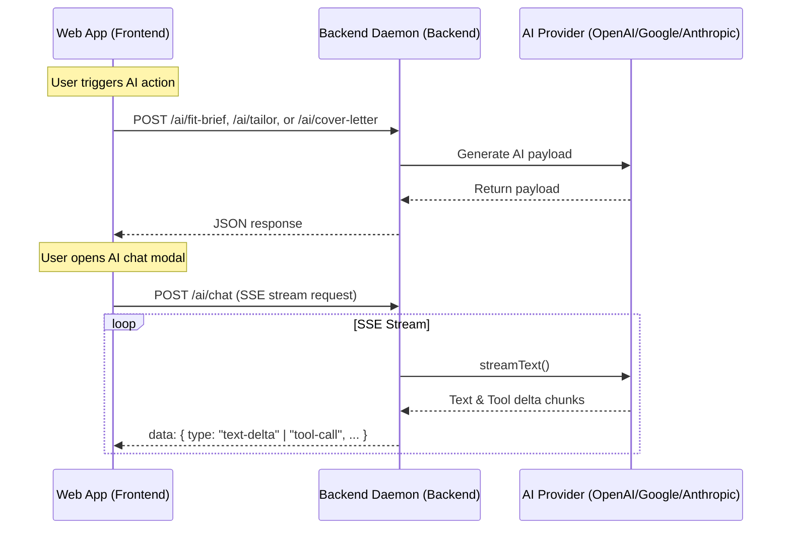

# Design: Remove Local Storage AI Provider & Migrate AI Features to Backend

**Date:** 2026-06-28
**Topic:** Remove local storage AI configuration and delegate all AI tasks (Fit Brief, Tailoring, Cover Letter, and Chat suggestions) to the local backend daemon (backend).

## Objective
Remove browser-based direct AI API calls and local storage configuration. Migrate all AI processing to the Fastify backend daemon. This ensures API keys are stored securely on the backend (in `.env` or system variables) rather than in the browser's local storage.

## Architecture

We will implement a streaming Server-Sent Events (SSE) chat endpoint and JSON endpoints in the backend backend.

## Detailed Component Changes

### 1. Backend (Fastify)
We will introduce a new routes file `apps/backend/src/routes/ai-routes.ts` defining:
* `POST /ai/fit-brief`:
  * Body: `{ job: JobApplication, resume: Resume }`
  * Action: Generate and parse `JobFitBrief` using active backend AI config.
* `POST /ai/tailor`:
  * Body: `{ job: JobApplication, fitBrief: JobFitBrief, resume: Resume }`
  * Action: Generate and parse `ResumeEditProposal[]`.
* `POST /ai/cover-letter`:
  * Body: `{ job: JobApplication, fitBrief: JobFitBrief, resume: Resume }`
  * Action: Generate and parse `CoverLetterDraft`.
* `POST /ai/chat`:
  * Body: `{ messages: Message[], context: Record<string, unknown> }`
  * Action: Use `streamText` from Vercel AI SDK to stream SSE responses. Loop over `result.fullStream` and write JSON data packets prefixed with `data: ` to the response.

We will register this route plugin in `apps/backend/src/server.ts`.

### 2. Web Frontend (Zustand & UI)
* **Delete Settings Slice**: Remove `apps/web/src/lib/settings-slice.ts`, `apps/web/src/lib/settings-store.test.ts`. Remove settings reference from `root-store.ts`.
* **Delete Settings UI**: Delete `apps/web/src/components/editor/GlobalSettingsModal.tsx` and remove it from `AppHeader.tsx`.
* **Migrate `job-ai.ts`**: Replace prompt-building and Vercel AI SDK execution in `apps/web/src/features/job-postings/job-ai.ts` with HTTP fetches calling the backend.
* **Migrate `InteractiveAIPromptModal.tsx`**: Update chat prompt submission to POST to `/ai/chat` on the backend, and parse the SSE stream lines (`text-delta` and `tool-call`).

## Verification Plan

### Automated Tests
* Update frontend test suite mocks (specifically in `Steps.test.tsx` and `root-store.test.ts`) to omit the deleted settings slice.
* Run `pnpm test` and `pnpm typecheck` to verify codebase builds cleanly.

### Manual Verification
* Run `pnpm dev` and generate a Job Fit Brief, Resume Tailoring, Cover Letter, and interact with the AI assistant modal in the resume editor. Ensure streaming works perfectly.
